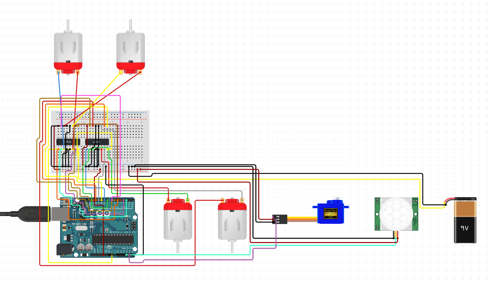

Controlling dc motors with L293D and ultrasonic sensor and a servo motor to change direction when an obstacle is detected.

## Wiring Diagram
This is a approximate wiring diagram for demonstration purposes.
